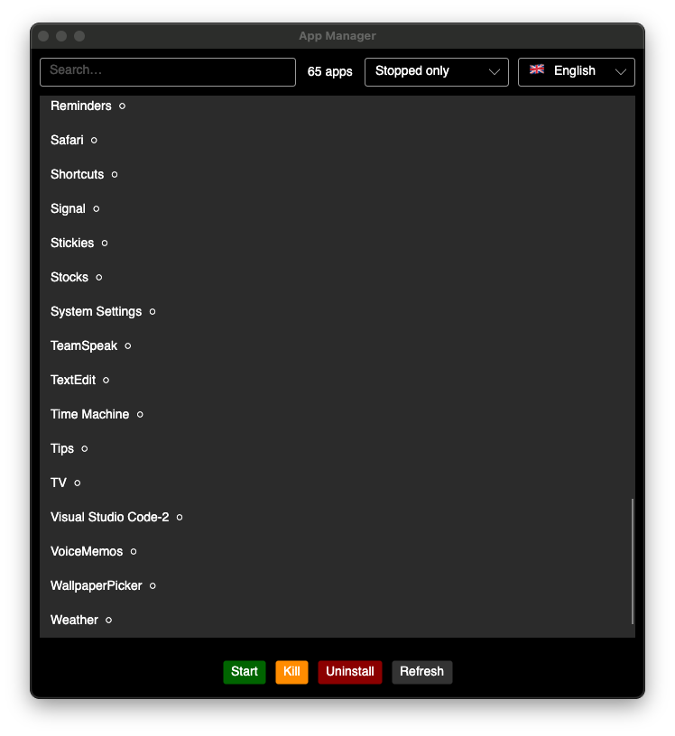

<div align="right">
  <a href="#-deutsch">🇩🇪 Deutsch</a> &nbsp;|&nbsp;
  <a href="#-français">🇫🇷 Français</a> &nbsp;|&nbsp;
  <a href="#-español">🇪🇸 Español</a> &nbsp;|&nbsp;
  <a href="#-italiano">🇮🇹 Italiano</a>
</div>

# AppManager

A lightweight, cross-platform desktop app to browse, launch, kill, and uninstall applications.

<p align="center">
  
</p>

<p align="center">
  
  
  
  
  
</p>

---

## Features

- **App browser** — lists all installed applications on your system
- **Search & filter** — search by name; filter by running / stopped
- **Multi-select** — select multiple apps and apply any action to all at once
- **Start** — launch any app with one click
- **Kill** — force-quit running apps instantly
- **Uninstall** — move apps to trash (macOS/Linux) or open system settings (Windows)
- **Refresh** — reload the app list at any time
- **Multi-language** — auto-detects your system language; dropdown to switch manually

---

## Download

Pre-built binaries are attached to every [release](../../releases/latest):

| Platform | File |
|---|---|
| macOS | `AppManager.dmg` — drag-to-Applications installer |
| Linux | `AppManager` — self-contained binary |
| Windows | `AppManager.exe` — self-contained executable |

> **macOS note:** The app is ad-hoc signed but not notarized. On first launch, right-click → **Open** and confirm. Alternatively, remove the quarantine flag once after installing:
> ```bash
> xattr -cr /Applications/AppManager.app
> ```

---

## Requirements (build from source)

- [.NET 10 SDK](https://dotnet.microsoft.com/download/dotnet/10.0)

---

## Build & Run

### Run directly

```bash
dotnet run
```

### Build a standalone binary

**macOS** — creates a `.app` bundle and a `.dmg` installer:
```bash
chmod +x build.sh && ./build.sh
# → AppManager.dmg
# → AppManager.app
```

**Linux** — creates a self-contained binary:
```bash
chmod +x build.sh && ./build.sh
# → dist/AppManager
```

**Windows** — creates a self-contained `.exe`:
```powershell
.\build.ps1
# → dist\AppManager.exe
```

---

## Usage

1. Launch the app.
2. Browse your installed apps; use the search bar or filter dropdown to narrow the list.
3. Select one or more apps (hold ⌘ or Shift for multi-select) and click the action button:
   - **Start** — opens the app(s)
   - **Kill** — force-quits the process(es)
   - **Uninstall** — moves to trash / opens system settings

---

## Platform Details

| Feature | macOS | Linux | Windows |
|---|---|---|---|
| App discovery | `/Applications` | `.desktop` files | `Program Files` |
| Start | `open -a` | `xdg-open` | Shell execute |
| Kill | Process API | Process API | Process API |
| Uninstall | Finder → Trash | `gio trash` | System settings |

---

## Languages

| Flag | Language |
|---|---|
| 🇬🇧 | English *(default / fallback)* |
| 🇩🇪 | Deutsch |
| 🇫🇷 | Français |
| 🇪🇸 | Español |
| 🇮🇹 | Italiano |

---

## Tech Stack

| Component | Technology |
|---|---|
| UI Framework | [Avalonia UI](https://avaloniaui.net) 12 |
| Runtime | .NET 10 |

---

## Project Structure

```
AppManager/
├── Program.cs          # Entry point
├── MainWindow.cs       # Avalonia GUI
├── AppHelper.cs        # Platform-specific app discovery
├── AppActions.cs       # Start / Kill / Uninstall
├── AppItem.cs          # App data model
├── Localization.cs     # Translations (EN/DE/FR/ES/IT)
├── AppManager.csproj   # Project file
├── build.sh            # macOS .app+DMG / Linux binary builder
├── build.ps1           # Windows .exe builder
└── assets/
    ├── screenshot_gui.png
    └── AppIcon.icns
```

---

<div id="-deutsch"></div>

---

## 🇩🇪 Deutsch

Ein schlanker, plattformübergreifender Desktop-App-Manager mit Avalonia-GUI.

- **App-Browser** — zeigt alle installierten Apps des Systems
- **Suche & Filter** — nach Name suchen, nach laufend/gestoppt filtern
- **Mehrfachauswahl** — mehrere Apps gleichzeitig auswählen (⌘ oder Shift) und gemeinsam verwalten
- **Starten / Beenden / Deinstallieren** — mit einem Klick
- **Mehrsprachig** — erkennt Systemsprache, Umschalter per Dropdown

```bash
dotnet run             # direkt starten
./build.sh             # macOS: .app + DMG / Linux: dist/AppManager
.\build.ps1            # Windows: dist\AppManager.exe
```

---

<div id="-français"></div>

## 🇫🇷 Français

Un gestionnaire d'applications léger et multiplateforme avec interface Avalonia.

- **Navigateur d'apps** — liste toutes les applications installées
- **Recherche & filtre** — par nom, par état (actif/inactif)
- **Sélection multiple** — sélectionnez plusieurs apps (⌘ ou Shift) et agissez sur toutes à la fois
- **Démarrer / Fermer / Désinstaller** — en un clic
- **Multilingue** — détection automatique de la langue système

```bash
dotnet run             # lancer directement
./build.sh             # macOS: .app + DMG / Linux: dist/AppManager
.\build.ps1            # Windows: dist\AppManager.exe
```

---

<div id="-español"></div>

## 🇪🇸 Español

Un administrador de aplicaciones ligero y multiplataforma con GUI Avalonia.

- **Navegador de apps** — lista todas las aplicaciones instaladas
- **Búsqueda y filtro** — por nombre o estado (activa/detenida)
- **Selección múltiple** — selecciona varias apps (⌘ o Shift) y aplica la acción a todas a la vez
- **Iniciar / Cerrar / Desinstalar** — con un clic
- **Multilingüe** — detecta el idioma del sistema automáticamente

```bash
dotnet run             # ejecutar directamente
./build.sh             # macOS: .app + DMG / Linux: dist/AppManager
.\build.ps1            # Windows: dist\AppManager.exe
```

---

<div id="-italiano"></div>

## 🇮🇹 Italiano

Un gestore di app leggero e multipiattaforma con interfaccia Avalonia.

- **Browser app** — elenca tutte le app installate nel sistema
- **Ricerca e filtro** — per nome o stato (in esecuzione/fermata)
- **Selezione multipla** — seleziona più app (⌘ o Shift) e agisci su tutte in una volta
- **Avvia / Termina / Disinstalla** — con un clic
- **Multilingue** — rileva automaticamente la lingua di sistema

```bash
dotnet run             # avvio diretto
./build.sh             # macOS: .app + DMG / Linux: dist/AppManager
.\build.ps1            # Windows: dist\AppManager.exe
```
